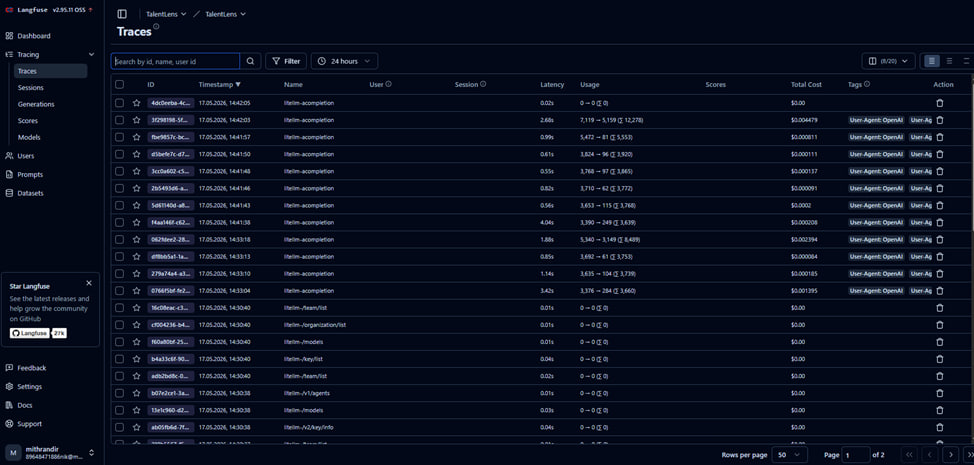
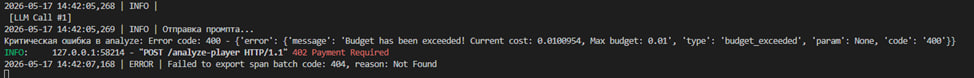

# Задание Промышленная эксплуатация

## 1. Развертывание Langfuse

Для системы AI-агента TalentLens был развернут Langfuse через Docker Compose.  
Langfuse используется для трассировок работы агента и позволяет отслеживать весь процесс выполнения запроса.

Langfuse доступен по адресу:
http://localhost:3000


Система собирает:

- входные запросы  
- промежуточные tool calls  
- ответы модели  
- latency  
- token usage  

На скриншоте представлены traces из Langfuse, где видно, что система корректно сохраняет запросы и информацию о работе AI-агента.



---

## 2. Интеграция Langfuse

В систему был интегрирован `Langfuse CallbackHandler`.  
Callback подключен к конфигурации LangChain-агента, благодаря чему каждая генерация автоматически отправляется в систему трассировок.

```python
from langfuse.langchain import CallbackHandler

langfuse_handler = CallbackHandler()

Также был изменен конфиг агента:

config = {
    "configurable": {"thread_id": session_id},
    "callbacks": [
        performance_tracker,
        langfuse_handler
    ]
}

Это позволяет сохранять:

prompts
tool calls
ответы модели
время выполнения
количество использованных токенов

## 3. Развертывание LiteLLM

LiteLLM используется как промежуточный слой между приложением и моделью.  
Через него проходят все запросы к модели.

LiteLLM позволяет:

- маршрутизировать запросы  
- использовать virtual keys  
- ограничивать бюджет  
- вести логи запросов  
- отслеживать использование модели  

LiteLLM доступен по адресу:
http://localhost:4000


На скриншоте представлены логи запросов из LiteLLM.


---

## 4. Подключение модели

В LiteLLM подключена основная модель проекта:
gpt-oss-120b

Все запросы теперь проходят не напрямую к модели, а через LiteLLM. А в логах LiteLLM можно увидеть сами запросы, используемую модель, токены и так далее.

## 5. Virtual Key и ограничение бюджета

В LiteLLM был создан virtual key с дневным лимитом:
$0.01/day


Все запросы приложения выполняются через данный virtual key.

После достижения лимита LiteLLM автоматически блокирует дальнейшие запросы и возвращает ошибку: budget_exceeded


Пример ошибки превышения бюджета:




## 6. Обработка превышения бюджета

В backend приложения была реализована обработка ошибки превышения бюджета.

Если LiteLLM сообщает о превышении лимита, система перехватывает исключение и возвращает пользователю HTTP 402 Payment Required вместо продолжения выполнения запроса.

Фрагмент кода:

```python
if (
    "402" in error_text
    or "budget" in error_text
    or "payment required" in error_text
    or "exceeded" in error_text
):
    raise HTTPException(
        status_code=402,
        detail="Дневной лимит LiteLLM исчерпан"
    )

На скриншоте представлен пример обработки ошибки превышения бюджета.

## 7. Итог

В результате была реализована инфраструктура промышленной эксплуатации AI-агента **TalentLens-AI**.

Система поддерживает:

- трассировки запросов  
- мониторинг работы модели  
- логирование tool calls  
- контроль latency  
- отслеживание token usage  
- маршрутизацию запросов через LiteLLM  
- использование virtual keys  
- ограничение бюджета  
- обработку ошибок превышения лимита  